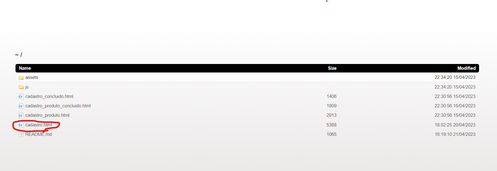
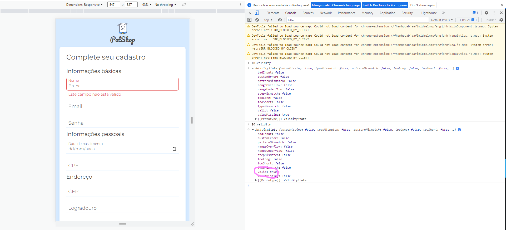

# Anotações

- Para garantir que o formulario seja preenchido corretamente use o required na tag html;
- Para preenchimento de email voce pode utilizar o type email;
- Voce pode definir o tamanho da sua senha pela minlengh ou o pattern;

## Validando a data de nascimento
### Erro:

Uncaught SyntaxError: Cannot use import statement outside a module.

- Significa que você não pode usar o arquivo js sem ser do tipo módulo, para corrigir esse problema vá ao arquivo HTML e dentro do script do js coloque o seguinte tipo.

````ruby
<script src="./js/app.js" type="module"></script>
````
- Depois disso, caso esteja no visual code garanta que você tenha a extensão live server.
- Caso esteja em outra IDE, com o node instalado e o npm, dentro do terminal digite os comandos:
- npm intall -g browser-sync

Caso você não consiga pelo comando anterior por falta de permissão, instale com usuário com os seguinte comando:
- sudo npm intall -g browser-sync 

Depois:
- browser-sync start -s -f . --directory

Vai aparecer a raiz do seu projeto no navegador...
 

Agora é só clicar no html pra abrir seu arquivo no navegador...

 

## Validando campo input e adiconando estilo de erro na página:

Para impedir que esse campo fique vazio você pode adicionar um required dentro da tag html, além disso, dentro da classe adicionamos uma segunda classe que será usada somente quando certa condição for verdadeira:  

````ruby
<div class="input-container input-container--invalido">
    <input name="nome" id="nome" class="input" type="text" placeholder="Nome" required>
````
Para "pegar" essa classe do html, a qual é pai do input, dentro do Js usaremos a propriedade:

 

 Dentro da função valida usamos o código:

 ````ruby
     if (input.validity.valid) {
        input.parentElement.classList.remove('input-container--invalido')
    } else {
        input.parentElement.classList.add('input-container--invalido')
    }
````
Ainda assim percebemos que a mensagem de erro está  muito generica, precisamos melhorar, então dentro do Js criamos um objeto que irá receber as mesnagens de erro do nosso sistema:

````ruby
const mensagensDeErro = {
    nome: {
        valueMissing: 'O campo nome não pode estar vazio.'
    },
    email: {
        valueMissing: 'O campo e-mail não pode estar vazio.',
        typeMismatch: 'O e-mail digitado não é válido.'
    },
    senha: {
        valueMissing: 'O campo senha não pode estar vazio.',
        patternMismatch: 'A senha deve conter entre 6 a 12 caracteres, deve conter pelo menos uma letra maiúscula, um número e não deve conter símbolos.'
    },
    dataNascimento: {
        valueMissing: 'O campo senha não pode estar vazio.',
        customError:'Você deve ser maior de 18 anos para se cadastrar.'
    }
}
````
Agora dentro da função valida, você terá que adicionar as mensagens:

````ruby
    if (input.validity.valid) {
        input.parentElement.classList.remove('input-container--invalido')
        input.parentElement.querySelector('.input-mensagem-erro').innerHTML = ''
    } else {
        input.parentElement.classList.add('input-container--invalido')
        input.parentElement.querySelector('.input-mensagem-erro').innerHTML = mostraMensagemDeErro(tipoDeInput, input)
    }
````
Depois criar uma função para "pegar" o erro:

````ruby
function mostraMensagemDeErro(tipoDeInput, input) {
    let mensagem = ''

    tiposDeErro.forEach(erro => {
        if (input.validity[erro]) {
            mensagem = mensagensDeErro[tipoDeInput][erro]
        }
    })
    return mensagem
}

````

Para facilitar a verificação também criamos uma varável que receberá os tipos de erro:`

````ruby
const tiposDeErro = [
    'valueMissing',
    'typeMismatch',
    'patternMismatch',
    'customError'
]
````
## Validando campo CPF:

- A primeira coisa a se fazer é formatar o CPF porque nunca se sabe em qual formato nosso querido usuário digitará. Para isso dentro do Js:

````ruby
function validaCPF(input) {
    const cpfFormatado = input.value.replace(/\D/g, '')
    let mensagem = ''
    input.setCustomValidity(mensagem)
}
````

Repare que usamos o replace, essa função substitui algo por algo :)

- Depois podemos fazer a checagem se há números repetidos criando outra função:

````ruby
function checaCPFRepetido(cpf) {
    const valoresRepetidos = [
        '00000000000',
        '11111111111',
        '22222222222',
        '33333333333',
        '44444444444',
        '55555555555',
        '66666666666',
        '77777777777',
        '88888888888',
        '99999999999'
    ]

    let cpfValido = true

    valoresRepetidos.forEach(valor => {
        if (valor == cpf) {
            cpfValido = false
        }
    })
    return cpfValido
}
````
- Depois usar a condição dentro de valida CPF:

````ruby
function validaCPF(input) {
    const cpfFormatado = input.value.replace(/\D/g, '')
    let mensagem = ''

    if (!checaCPFRepetido(cpfFormatado)) {
        mensagem = 'O CPF digitado não é valido.'
    }
    input.setCustomValidity(mensagem)
}
````
- E é só fazer a chamada em validadores:

````ruby
const validadores = {
    dataNascimento: input => validaDataNascimento(input),
    cpf:input => validaCPF(input)
}
````

- Não esqueça de adicionar mais um atributo em nosso objeto de erros:

````ruby
const mensagensDeErro = {
    cpf: {
        valueMissing: 'O campo CPF não pode ser vazio.',
        customError: 'O CPF digitado não é válido.'
    }
}
````

- Agora para segunda estapa de verificação de um cpf válido, usaremos a conta que estará explicada no vídeo abaixo do canal Planeta Educação:

<link rel="stylesheet" href="https://www.youtube.com/embed/15Bw0duulMQ">

- Depois criamos a função que corresponde a essa explicação:

````ruby
function checaEstruturaCPF(cpf) {
    const multiplicador = 10
    return checaDigitoVerificador(cpf, multiplicador)
}

function checaDigitoVerificador(cpf, multiplicador) {
    if (multiplicador >= 12) {
        return true;
    }
    let multiplicadorInicial = multiplicador;
    let soma = 0;
    const cpfSemDigitos = cpf.substr(0, multiplicador - 1).split('');
    const checaDigitoVerificador = cpf.charAt(multiplicador - 1);
    for (let contador = 0; multiplicadorInicial > 1; multiplicadorInicial--){
        soma = soma + cpfSemDigitos[contador] * multiplicadorInicial;
        contador++;
    }

    if (checaDigitoVerificador == confirmaDigito(soma)) {
        return checaDigitoVerificador(cpf, multiplicador + 1);
    }

    return false;
}

function confirmaDigito(soma) {
    return 11 -(soma % 11)
}
````

- Agora adicionar a verificação no valida CPF:

````ruby

function validaCPF(input) {
    const cpfFormatado = input.value.replace(/\D/g, '')
    let mensagem = ''

    if (!checaCPFRepetido(cpfFormatado) || !checaEstruturaCPF(cpfFormatado)) {
        mensagem = 'O CPF digitado não é valido.'
    }
    input.setCustomValidity(mensagem)
}

````

## Validando CEP

Podemos utilizar uma API que preenche o endereço automaticamente com o CEP digitado, mas para que isso ocorra precisamos validá-lo primeiro:
- O primeiro passo é ir no HTML  e adicionar o data-tipo, o required e o pattern pra garantir que haja apenas dítos ([\d]), cinco caracteres ({5}), hífen opcional (-?), dítos ([\d]) e  três carateres {3}.

````ruby
 <input name="cep" id="cep" class="input" type="text" placeholder="CEP" pattern="[\d]{5}-?[\d]{3}" data-tipo="cep" required>
````

- Depois em js adicionar mais uma mensagem de erro:

````ruby
const mensagensDeErro = {
    cep: {
        valueMissing: 'O campo CEP não pode ser vazio.',
        patternMismatch: 'A CEP digitado não é válido.'
    }
}
````
- Pra ir finalizando, crie data-tipo pra logradouro, cidade e estado e também adicione o required;
- Depois no arquivo js adicione as mensagens de erro para esses elementos;
- Agora vamos chamar a função que enviará os dados para API EM validadores:

````ruby
const validadores = {
    dataNascimento: input => validaDataNascimento(input),
    cpf: input => validaCPF(input),
    cep: input=> recuperarCEP(input)
}
````

- E criar a função que fará a busca e o retorno:

````ruby
function recuperarCEP(input) {
    const cep = input.value.replace(/\D/g, '');
    const url = `https://viacep.com.br/ws/${cep}/json/`;
    const options = {
        method: 'GET',
        mode: 'cors',
        headers: {
            'content-type': 'application/json;charset=utf-8'
        }
    }
    if (!input.validity.patternMismatch && !input.validity.valueMissing) {
        fetch(url, options).then(
           response => response.json()
        ).then(
            data => {
                if (data.erro) {
                    input.setCustomValidity('Não foi possível buscar o CEP.');
                    return;
                }
                input.setCustomValidity('');
                preencheCampoComCEP(data);
                return
           }
       )
    }
}
````
- E agora vamos criar a função que vai preencher os campos automaticamente:

````ruby
function preencheCampoComCEP(data) {
    const logradouro = document.querySelector('[data-tipo="logradouro"]');
    const cidade = document.querySelector('[data-tipo="cidade"]');
    const estado = document.querySelector('[data-tipo="estado"]');

    logradouro.value = data.logradouro;
    cidade.value = data.localidade;
    estado.value = data.uf;
}
````

- E depois adicionar a chamada na função anterior (já adicionei).

method: 'GET' é o tipo de requisição que será feita.

mode: 'cors' indica que a comunicação será feita entre aplicações diferentes.

headers: {'content-type': 'application/json;charset=utf-8'} diz como que queremos receber as informações da API.