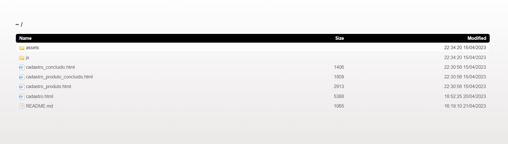

# Anotações

- Para garantir que o formulario seja preenchido corretamente use o required na tag html;
- Para preenchimento de email voce pode utilizar o type email;
- Voce pode definir o tamanho da sua senha pela minlengh ou o pattern;

## Validando a data de nascimento
### Erro:

Uncaught SyntaxError: Cannot use import statement outside a module.

- Significa que você não pode usar o arquivo js sem ser do tipo módulo, para corrigir esse problema vá ao arquivo HTML e dentro do script do js coloque o seguinte tipo.

````ruby
<script src="./js/app.js" type="module"></script>
````
- Depois disso, caso esteja no visual code garanta que você tenha a extenção live server.
- Caso esteja em outra IDE, com o node instalado e o npm, dentro do terminal digite os comandos:
- npm intall -g browser-sync

Caso você não consiga pelo comando anterior por falta de permissão, instale com usuário com os seguinte comando:
- sudo npm intall -g browser-sync 

Depois:
- browser-sync start -s -f . --directory

Vai aparecer a raiz do seu projeto no navegador...
 

Agora é só clicar no html pra abrir seu arquivo no navegador...

 

## Validando campo input e adiconando estilo de erro na página:

Para impedir que esse campo fique vazio você pode adicionar um required dentro da tag html, além disso, dentro da classe adicionamos uma segunda classe que será usada somente quando certa condição for verdadeira:  

````ruby
<div class="input-container input-container--invalido">
    <input name="nome" id="nome" class="input" type="text" placeholder="Nome" required>
````
Para "pegar" essa classe do html, a qual é pai do input, dentro do Js usaremos a propriedade:

 

 Dentro da função valida usamos o código:

 ````ruby
     if (input.validity.valid) {
        input.parentElement.classList.remove('input-container--invalido')
    } else {
        input.parentElement.classList.add('input-container--invalido')
    }
````
Ainda assim percebemos que a mensagem de erro está  muito generica, precisamos melhorar, então dentro do Js criamos um objeto que irá receber as mesnagens de erro do nosso sistema:

````ruby
const mensagensDeErro = {
    nome: {
        valueMissing: 'O campo nome não pode estar vazio.'
    },
    email: {
        valueMissing: 'O campo e-mail não pode estar vazio.',
        typeMismatch: 'O e-mail digitado não é válido.'
    },
    senha: {
        valueMissing: 'O campo senha não pode estar vazio.',
        patternMismatch: 'A senha deve conter entre 6 a 12 caracteres, deve conter pelo menos uma letra maiúscula, um número e não deve conter símbolos.'
    },
    dataNascimento: {
        valueMissing: 'O campo senha não pode estar vazio.',
        customError:'Você deve ser maior de 18 anos para se cadastrar.'
    }
}
````
Agora dentro da função valida, você terá que adicionar as mensagens:

````ruby

````

